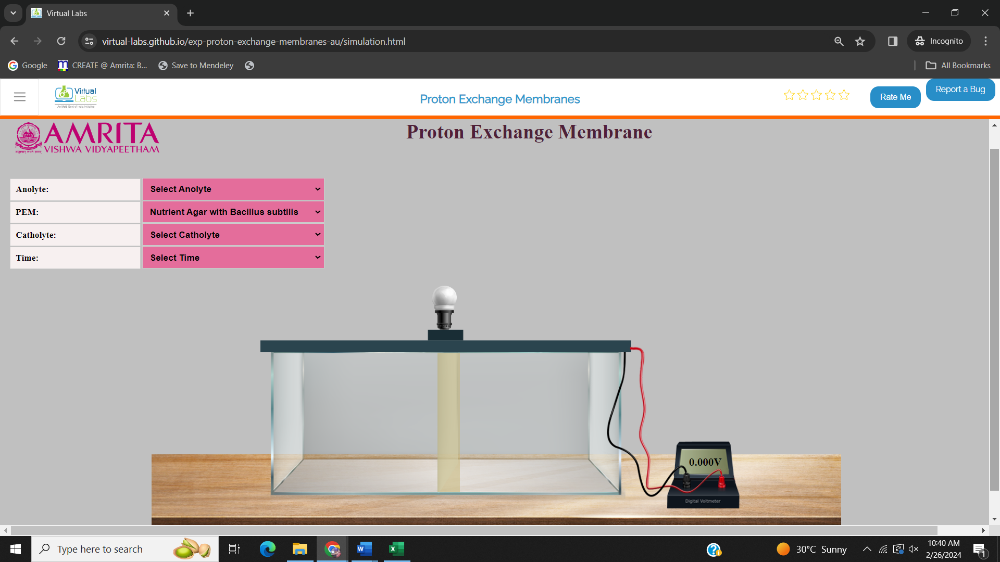
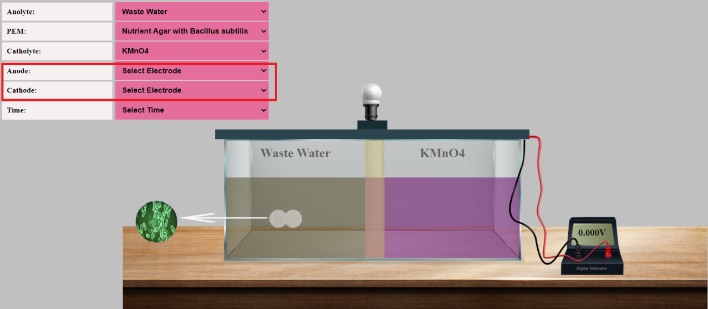
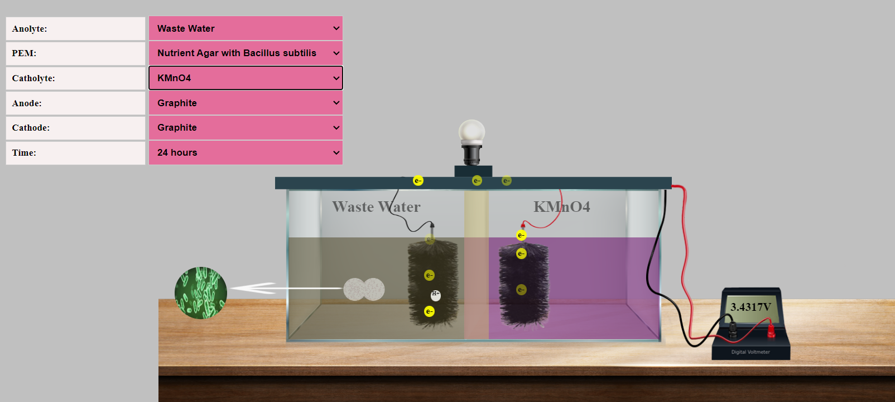
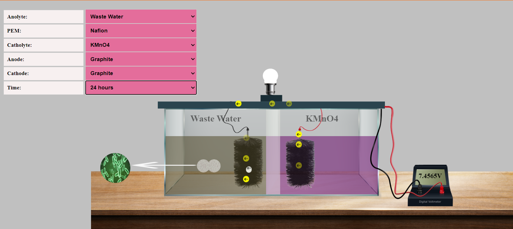
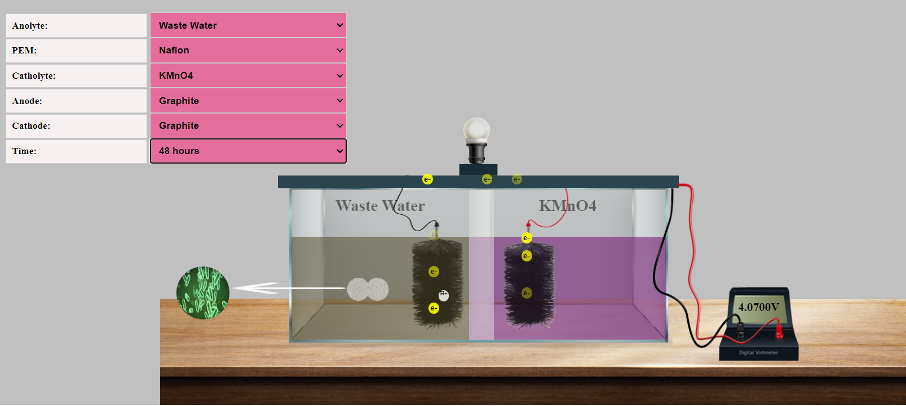
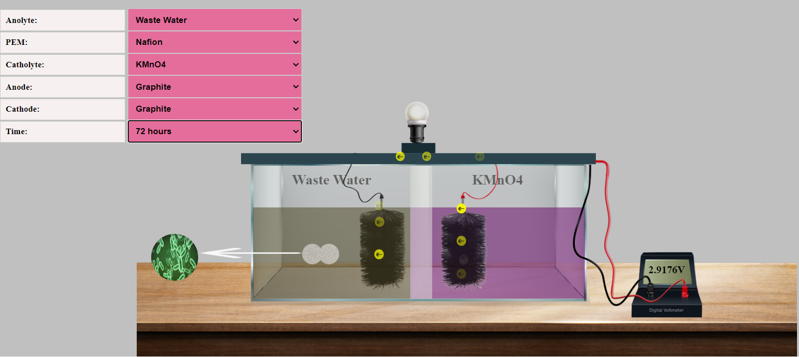

### Procedure

1.	Users can open the simulator window. In the simulator window,  input parameters Anolyte, PEM, Catholyte, and Time were provided. The design of a microbial fuel cell is also displayed. The MFC is connected to a Voltmeter to measure the output voltage for each input parameter.
 
 

&nbsp;

2.	Users can select Anolyte, PEM, Catholyte, and Time duration to run the simulator. In the interface, PEM is selected as Nutrient agar with Bacillus subtilis. To study the change in the output voltage depending on PEM,  users can change the PEM and finalize the best PEM for MFCs in the laboratory setting. 

3.	Users can change the parameters according to their choice. The anolyte provided in the interface is Wastewater. PEM has the choice of Nutrient agar with Bacillus subtilis and Nafion. Catholyte options are KMO4 and water. When Catholyte is selected, users can see the options to select Cathode and Anode. Users can choose Anode as either Aluminium, Manganese, Graphite, or Stainless Steel, and Cathode as either Copper or Graphite. The time interval provided is 24hrs, 48hrs and 72hrs. 
 

 
&nbsp;

&nbsp;

4.	To practice the simulator, users can provide Anolyte as Wastewater, PEM as Nutrient agar, Catholyte as KMO4, anode as Graphite, and Cathode as Graphite. Select time as 24hrs. Here graphite brushes are used as electrodes as it has a higher surface area compared to rods. When the input parameters were given, the protons moved to the catholyte through PEM and electrons moved towards the external circuit to produce current. Users can see the production of electricity by observing the bulb. From the voltmeter, it is observed that the voltage produced is 3.4317 V

 
&nbsp;

&nbsp;

5.	To study the choice of PEM, users can change the PEM to Nafion, and the time duration is 24 hours. In the voltmeter, it is observed that the voltage produced is 7.4565 V

 
&nbsp;

&nbsp;

 
6.	Now change the time to 48 hours and observe the voltage change. At 48 hours the voltage produced is 4.0700V

 
&nbsp;

&nbsp;

7.	At 72 hours, the voltage produced is 2.9176V. The results indicated that Nafion is the best choice as PEM to produce more bioelectricity. And also, it is noted that when time increases the microorganisms utilize the substrate in the wastewater, and the subsequent depletion of nutrients results in less production of electrons and protons followed by voltage reduction. 

 
&nbsp;

&nbsp;

8.	Users can change different parameters and learn the best PEM and electrode combinations for producing more electricity. 

