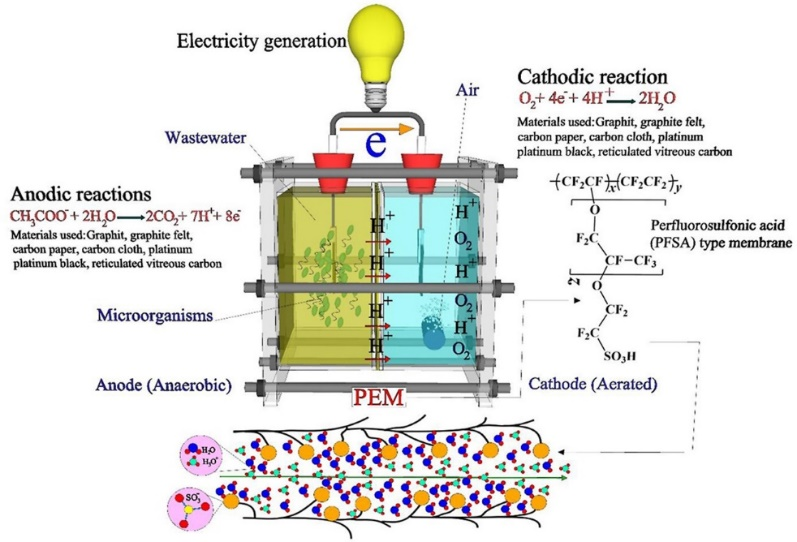

### Introduction

A Microbial Fuel Cell (MFC) works in a bio-electrochemical process that produces electrical energy by converting the organic matter with the help of microorganisms. The energy generated by MFCs can be used to supply energy for wastewater treatment plants in urban areas. A typical microbial fuel cell consists of an anode and a cathode divided by a cation exchange membrane. The organic compounds present in the wastewater in anode chamber get oxidized by the action of microorganisms to produce electrons and protons. The electrons produced by the bacteria in the anode compartment move to the cathode compartment through an exterior circuit. 

nCH2O+nH2O→nCO2+4ne− +4nH+
	
The released protons move to the cathode across the membrane, called the Proton Exchange Membrane, with an oxidizing environment current in the cathode chamber. Electrons and protons are finally present in the cathode chamber reducing oxygen to form a water molecule. Oxygen is the terminal electron acceptor to carry out reactions at the cathode compartment. 

nO2+4ne−+4nH+→2nH2O

The component that facilitates electrochemical reactions with the microbial fuel cell is the Proton Exchange Membrane (PEM) which creates a proton gradient that is essential for the generation of electrical current. Different types of PEMs exist that have different levels of proton conductivity chemical stability, durability, and functionality. These features contribute directly to the success of MFC technology in sustainable energy production and environmental applications. 

### Theory	

As we discussed in the previous experiments, microbial fuel is a novel technology that works in the production of bioenergy in the form of hydrogen ions or electricity by directly utilizing the organic and inorganic substrates as a way of treating biodegradable contaminants in wastewater. The electrons are provided from the chemical bonds by microorganisms and the reduction in the anode was catalyzed by the organisms in the substrate of the anode chamber. The electrons flow toward the electrical circuit and the protons move through the proton exchange membrane to the cathode. This flow of electrons creates a current (I) and a power (P). 

Certain parameters need to be considered that influence the electron transfer mechanisms and power generation thereby enhancing the performance of Microbial Fuel Cells. This included cell metabolism by microorganisms, the electron transfer process by microbes, the transfer of protons through the proton exchange membrane, external and internal resistances, and the oxidation reaction at the cathode. The biocatalysts in the MFCs are electrogenic microbial cells that can transfer the electrons through metabolism across the cell membrane with direct outer membrane c-type cytochrome pathways or anode coupling, through either redox electron shuttles or using electrically conductive pili. The electrons move toward the anode and then move to the external circuits without any artificial components. The cathode and anode membranes are separated by a salt bridge or proton exchange membrane (PEM), which functions to transfer the produced protons from the anode compartment to the cathode compartment. It should be noted that the efficiency and economic viability of a MFC are directly dependent on the performance of the PEM. 

This experiment highlights the types of PEMs that can be used in MFCs and visualizes how the choice of PEM affects the performance of MFCs in current and voltage generation. 
Overview of Proton Exchange Membranes in MFCs
Most of the MFCs constructed in laboratory settings have two separate chambers: an anode chamber and a cathode chamber which is separated by an ion-selective membrane that allows only the transfer of proton from anode to cathode preventing diffusion of oxygen in the anode chamber from the cathode chamber. Generally, the microorganism in the anodic chamber undergoes metabolic processes and releases electrons as a byproduct. The electrons flow from the anode electrode to the cathode through an external circuit and this flow constitutes electric current generation.  During the process, released protons at the anode are transferred to the cathode through the PEM where they combine with oxygen and electrons to form water. As discussed, this selective membrane contributes to the performance of MFC(Fig.1).

&nbsp;

Fig.1. Anodic and cathodic reactions and transfer of proton and electrons in a microbial fuel cell

Adapted from : Shabani, M., Younesi, H., Pontié, M., Rahimpour, A., Rahimnejad, M. and Zinatizadeh, A.A., 2020. A critical review on recent proton exchange membranes applied in microbial fuel cells for renewable energy recovery. Journal of cleaner production, 264, p.121446.

&nbsp;

 Different types of PEM are used in MFC, which vary in their material composition and characteristics. Examples include porous proton exchange membranes and nonporous membranes called dense membranes. The choice of the PEM depends on the experimental conditions including types of wastewater treatment, membrane stability, and MFC performance goals. Porous PEMs are structured with interconnected pores or channels for the transfer of ions including H+ ions while the passage of electrons is inhibited. Nonporous (Dense) Proton Exchange membranes are densely packed without any pores that also allow proton passage and inhibit the flow of electrons. It acts as an effective electron barrier and prevents microbial contamination and crossover of organisms from the anode to the cathode. It also permits the flow of other gaseous products including carbon dioxide (CO2) in the anodic chamber and oxygen(O2) in the cathodic chamber.

In most laboratory settings, the choice as proton exchange membrane (PEM) for MFCs is Nafion™ due to its highest proton conductivity and an ionomer with a perfluorinated backbone such as Teflon. The characteristics of Nafion included high hydrophobicity due to the presence of perfluoroalkyl backbones, exhibiting high proton conductivity, chemical stability, and durability, which helps to improve MFC performance under specific conditions. In an MFC, PEM equilibrates the cation species (positive ions) in the anolyte and catholyte solution. Some structures of Nafion are not thermostable at temperatures higher than 90oC. In such cases use of a composite membrane Nafion-silicon oxide (SiO2)- acid with thermostability, less resistance, higher proton conductivity with high current density is a choice as PEM. Another example is the Nafion 117 membrane which has more mechanical and thermal stability compared to other Nafion components. A comparative study of PEM as carbon Nano fiber indicated that it could produce about 1.5 times more power compared to the Nafion 117. Another study used sulfonated poly ether ether ketone (SPEEK) as PEM that produced a power of 77.3 mWm-2 which is less compared to Nafion 117. Another study indicated that the mass transfer area of the PEM is important in determining the production of power in MFCs. Nafion membrane with mass transfer areas 3.14 cm2, 9 cm2 and 16 cm2 produced power density of 105.8mW m-2, 126 mW m-2 and152 mW m-2.

In this experiment, Nutrient agar with Bacillus subtilis is also indicated as a proton exchange membrane. Bacillus subtilis is a gram-positive bacterium that is found in soil. It produces various enzymes that will enhance the electrochemical activity and electron transfer mechanisms in the MFC. Consideration of electrochemical properties, membrane characteristics, and scalability of the system must be important while using Nutrient agar with Bacillus subtilis as the PEM. Sometimes nutrient agar can be used as PEM but the ion-conductive properties of nutrient agar are not sufficient for efficient proton transfer in an MFC. Also, agar-based systems lack mechanical stability and increase the risk of contamination. It can be applied in the laboratory setting to study the working of MFC, and for scaling of electricity production, one has to use materials designed with better ion exchange properties and proton conductivity. Another choice of PEM in a laboratory setting is terracotta which is porous and durable. Still, challenges exist on the selective permeability for protons, ion conductance, mechanical stability, and cross-contamination. The experiment interfaces also showed graphite brushes as electrodes, as they can produce more power due to their increased surface area when compared to rods or sheets of electrode materials. 
